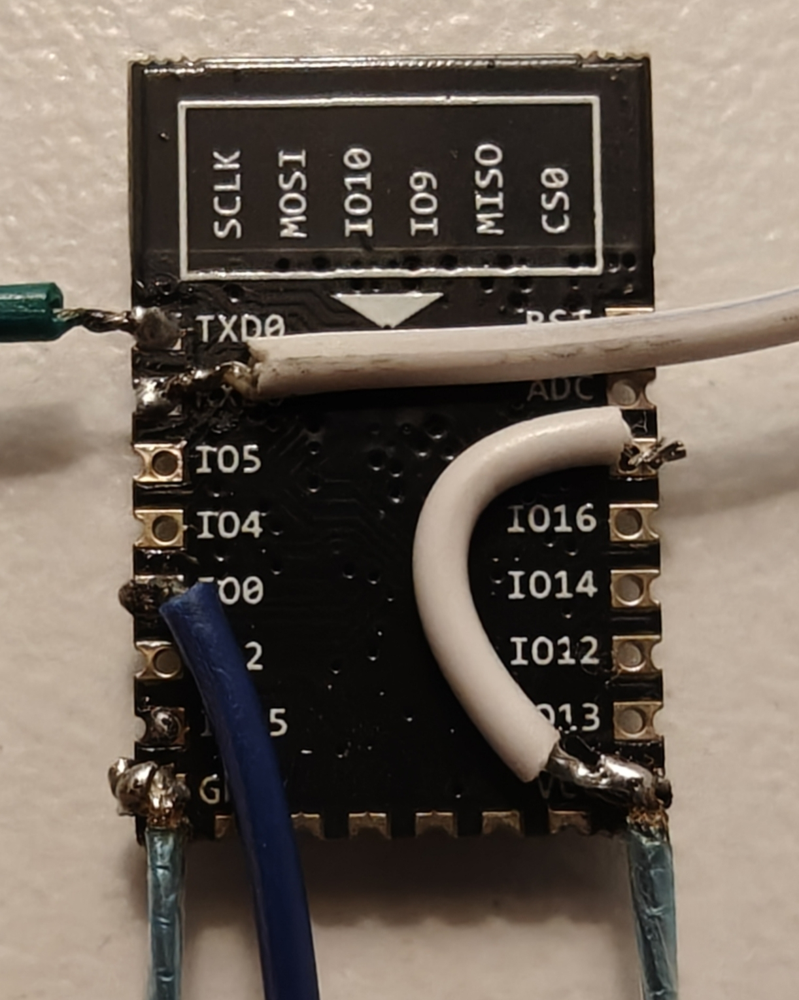
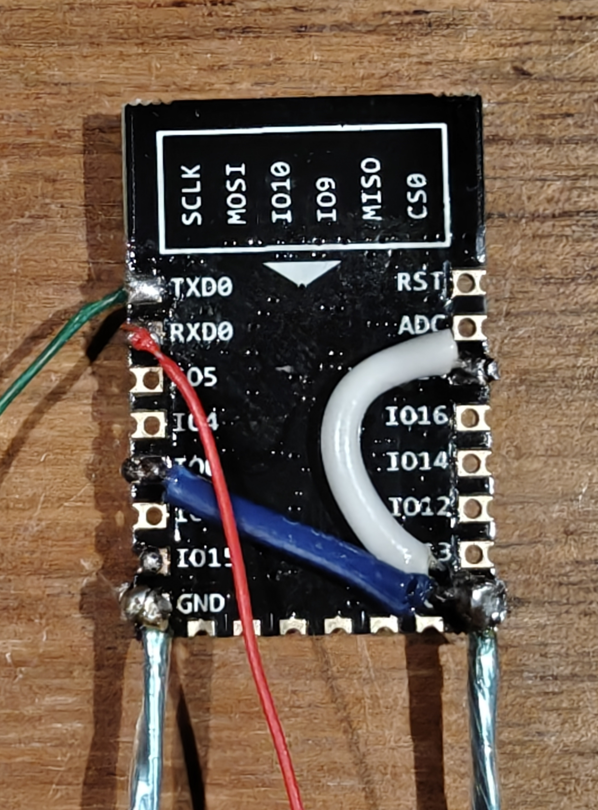
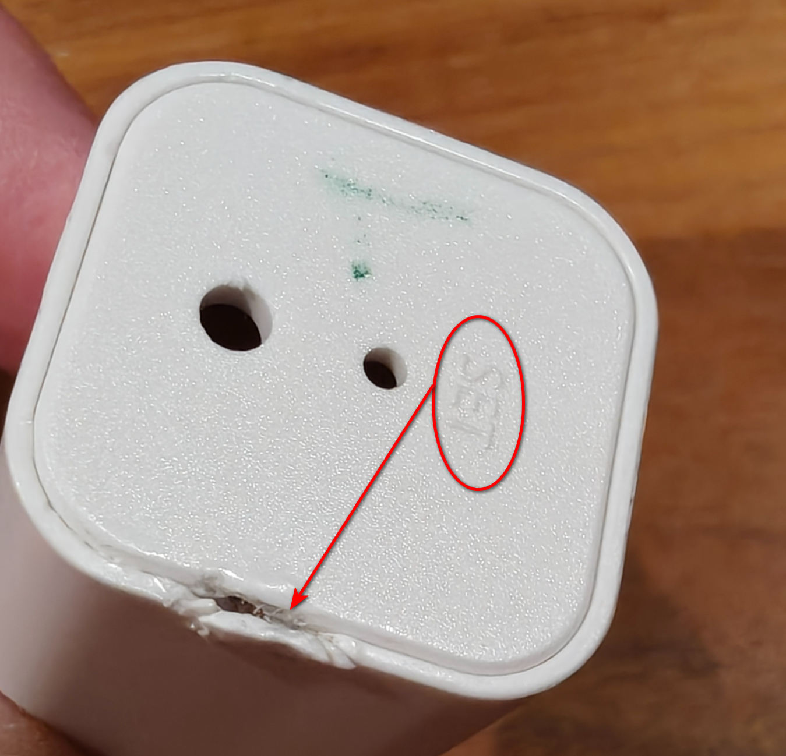
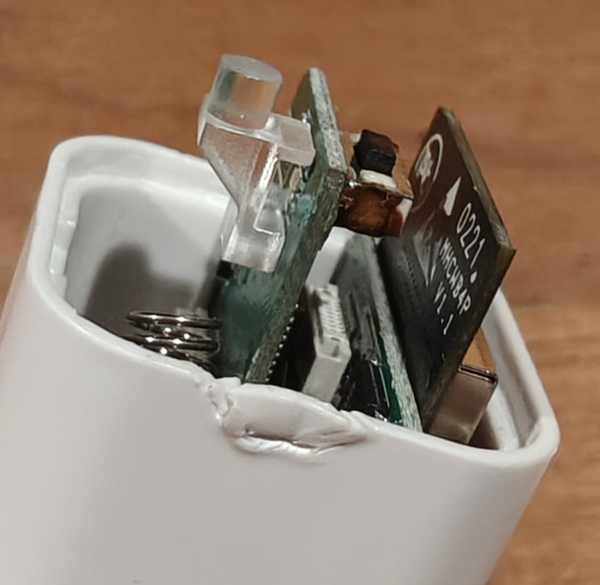
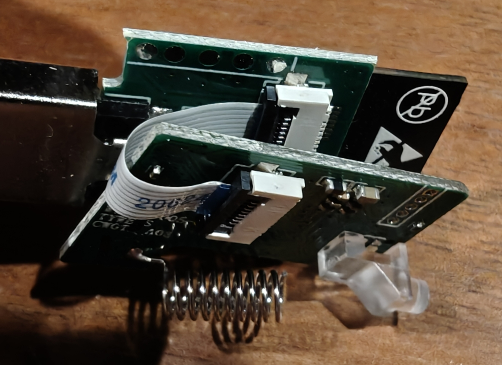
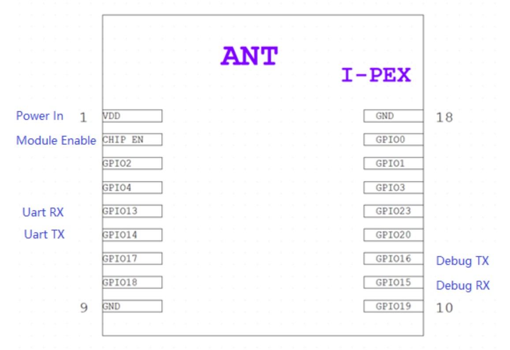
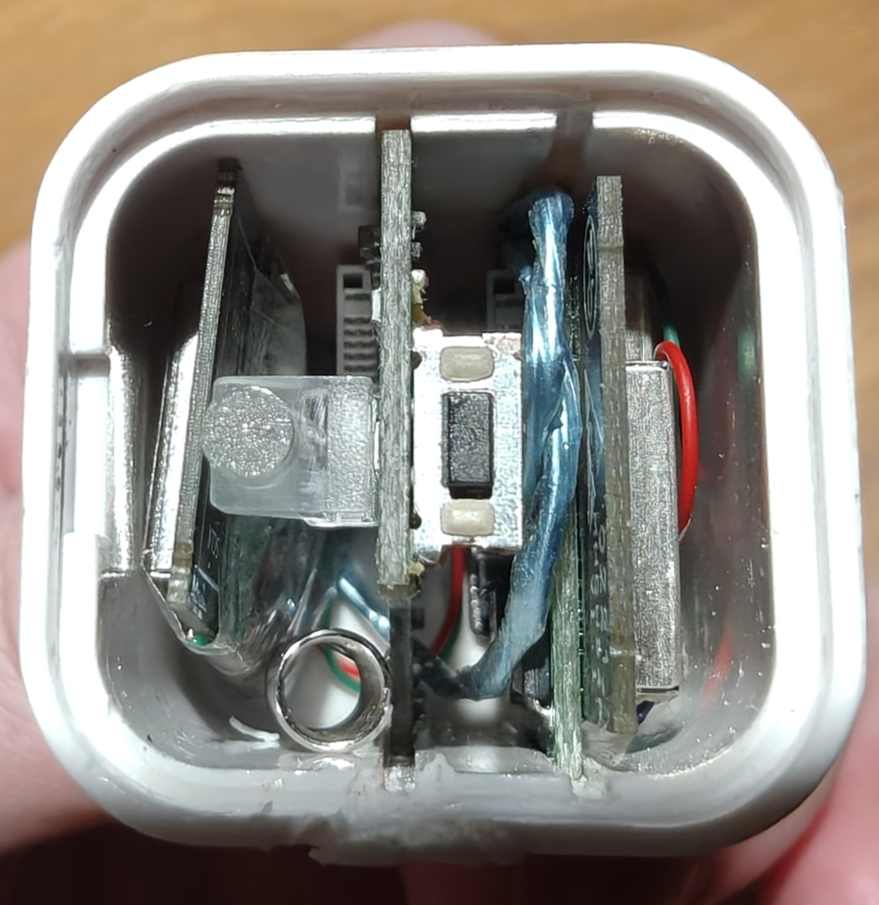
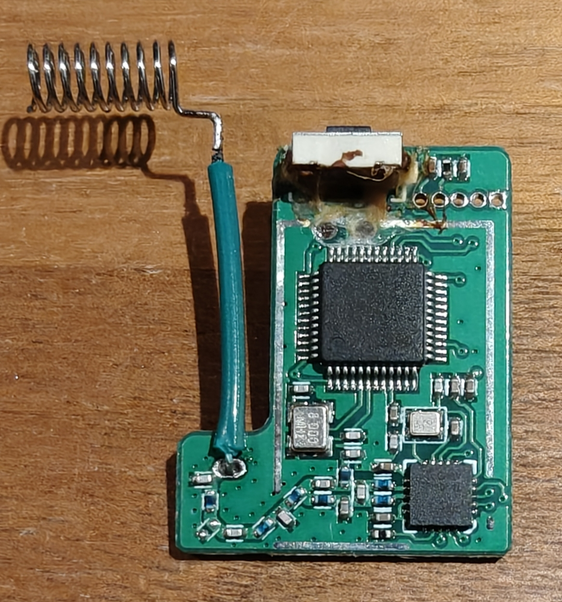
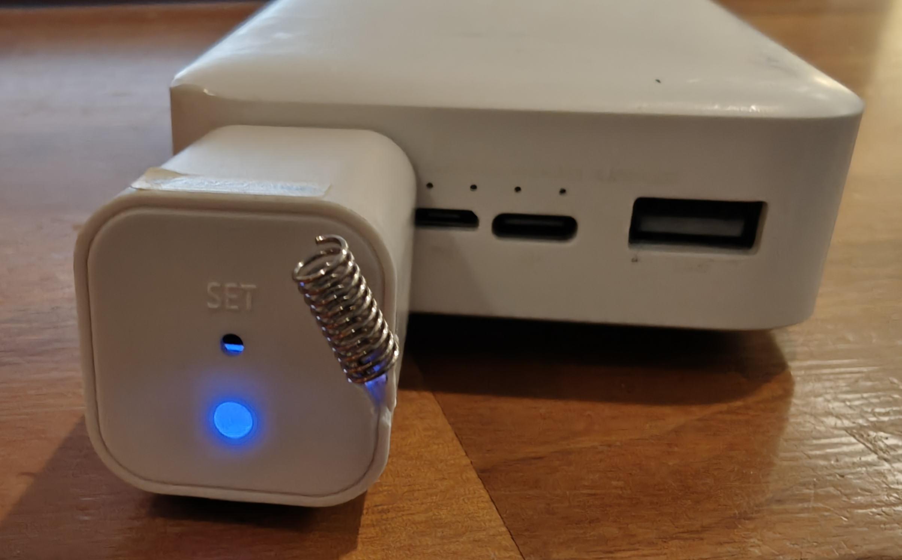
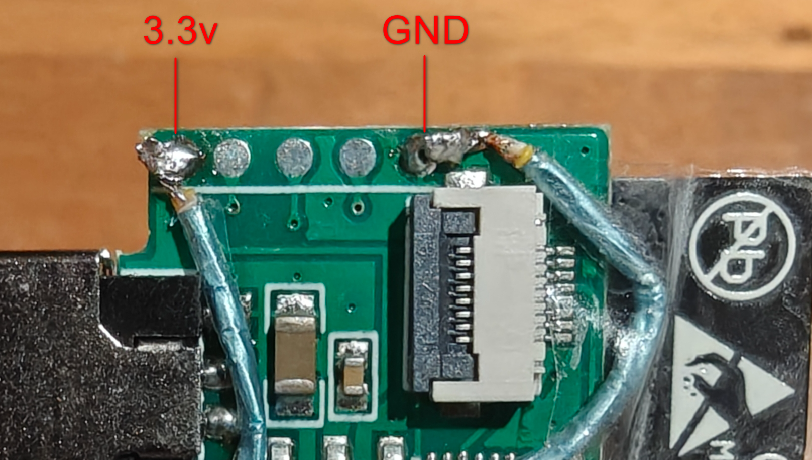

# ESPHome firmware: Zemismart curtain / blind M515E   babai.curtain.m515e

[English](./README.md) | [Russian](./README_RU.md)

> [!TIP]
> Этот способ модификации и/или конфигурация прошивки могут быть использованы не только для babai.curtain.m515e, но и для других похожих устройств в экосистемах Tuya и Xiaomi.

 
Первая версия моего умного дома строилась на облачных технологиях. Однако я быстро понял, что умный дом должен базироваться исключительно на локальном контроле. Только локальные устройства способны обеспечить надежность и комфорт. В ином случае вы рискуете получить разочарование.

Как выяснилось, Zemismart M515E можно интегрировать в Home Assistant с помощью [hass-xiaomi-miot](https://github.com/al-one/hass-xiaomi-miot) и официальной интеграции [ha_xiaomi_home](https://github.com/XiaoMi/ha_xiaomi_home). Устройства могут работать в локальном режиме, но поддерживают только управление без обратной связи. К сожалению, в работе всех моих 3 устройств периодически происходили сбои: они переставали отвечать и принимать команды.

Устройство базируется на MHCWB4P-B - RTL8720CN, и на текущий момент существует способ [LibreTiny](https://github.com/libretiny-eu/libretiny/issues/44#issuecomment-2514974466) - [ltchiptool FIX](https://github.com/prokoma/ltchiptool/tree/ambz2-fix-release), который позволяет установить кастомную прошивку на этот чип.  

Но чтобы перевести чип в режим загрузки прошивки, нужно подключить GPIO0 к 3.3v. Но выяснилось, что этот контакт железно посажен на GND, и если подать на него 3.3v, то произойдет замыкание.  
Из 3 устройств, которые у меня были, удалось только на одном убрать припой таким образом, чтобы между основной платой и платой чипа образовался зазор, позволяющий разомкнуть контакт GPIO0 c GND. На остальных двух платах компоненты прилегали слишком плотно друг к другу, чтобы полностью удалить олово для разрыва контакта. И только одно устройство я смог перевести в режим загрузки прошивки. Однако после соединения почти сразу происходил разрыв связи, как я понял, из-за циклической перезагрузки чипа. Поскольку на 2 устройствах мне все равно не удалось разомкнуть GPIO0 и GND, я решил отключить встроенный чип и заменить его на ESP.

У меня уже были ESP8266 и по размеру они помещаются в корпус модуля связи (донгла), поэтому я выбрал их (можно найти за 1 доллар на Aliexpress). Также можно использовать ESP32-C3 **Super Mini**, и в этом случае процесс первичной прошивки будет более простым и вам не понадобится USB-TTL адаптер.    

 

  
КОМПИЛЯЦИЯ ПРОШИВКИ
 

  Скомпилируйте прошивку в [ESPHome Device Builder](https://esphome.io/), используя готовую конфигурацию [babai.curtain.m515e](https://github.com/theodorx7/babai-curtain-m515e-esphome-firmware/tree/main/config), созданную с учётом индивидуальных особенностей устройства. Она создаёт в Home Assistant полноценную сущность `cover` и расширяет возможности по сравнению со штатной прошивкой производителя.

### Проблемы исходного устройства и реализованные исправления

- Устройство не предоставляет полноценного набора состояний: статусы движения отсутствуют, а мотор передаёт только финальную позицию после завершения команды. Также взаимодействие с мотором идёт по асинхронной цепочке: HA ⟷ ESP ⟷ MCU ←RF связь→ Мотор.  
  **Решение:** реализован собственный промежуточный слой управления, который полностью берёт на себя логику `cover`, генерацию состояний и state machine на уровне прошивки.

- Если RF-команды отправлять слишком быстро, то мотор не успевает обработать их все.  
  **Решение:** реализован механизм отложенной отправки с интервалом между командами, при котором новая команда перекрывает предыдущую, до MCU доходит только последняя актуальная команда.

- Во время движения мотор не отдает обратную связь, не стримит текущую позицию и не публикует статусы `Opening` / `Closing`.   
  **Решение:** статусы `Opening` / `Closing` формируются в прошивке локально на основе отправленной команды и последней известной позиции, а завершение движения фиксируется по финальному статусу от мотора. Если финальный статус позиции не приходит, watchdog по таймауту переводит состояние `cover` в `IDLE`, чтобы оно не зависало в `Opening` / `Closing`.

- После перезагрузки питания ESP загружается и подключается к Home Assistant быстрее, чем MCU успевает передать фактический статус. А Home Assistant выставляет статус по умолчанию - `Open`. Позже приходит фактический статус, из-за чего возникает дребезг.  
  **Решение:** сначала выполняется синхронизация позиции с мотором. Только после этого включаются Wi-Fi и API. `cover` становится доступна в Home Assistant уже с корректным состоянием. Если после старта в течение 3 минут не придет статус, Wi-Fi включается, и подключение к Home Assistant выполняется независимо от наличия состояния.

- После отправки команд MCU публикует echo старой исходной позиции вместо новой целевой, из-за чего возникает откат, дребезг состояния.  
  **Решение:** реализована фильтрация ранних входящих статусов, чтобы они не публиковались как актуальный результат только что отправленной команды. При ручном управлении мотором с кнопок на корпусе эта фильтрация не вмешивается в обработку статусов, так как применяется только для сценариев, инициированных из HA.

- Штатный polling на уровне компонента `esphome-miot` публикует статус из кэша MCU, который может не совпадать с фактическим. Например, если мотор начал движение с 0 до 100, то во время движения polling отдаёт исходную позицию, а не промежуточную или целевую. Только после завершения движения мотор присылает актуальный статус позиции, из-за чего возникает дребезг состояния.  
  **Решение:** используется собственный форк компонента `esphome-miot`, в котором штатный polling отключён. Вместо этого сделан свой скрипт polling, который выполняется только в безопасном состоянии `IDLE`.

- У 2 из 3 моих экземпляров наблюдается дребезг финального статуса позиции в пределах ±1% относительно фактической.  
  **Решение:** если финальный статус позиции отличается от целевого не более чем на `±1%`, в прошивке он принудительно приводится к целевому значению.

Если смотреть на логи, то мотор не отправляет регулярные отчеты в MCU. Передает только позицию и только после получения команды `STOP` или завершения движения после команд `open/close/target` или завершения команд, инициированных нажатием кнопок на корпусе мотора. Если необходимо гарантированно получить некэшированный, а актуальный статус текущей позиции, то можно отправить команду `STOP`. И если RF сигнал от мотора дойдет до MCU, то состояние обновится до актуального.  

Для Roller Mode (siid2 piid4) мотор не отдает состояние.  

 

  
ПРОШИВКА ESP8266
 
  
  - Активируйте чип: соедините EN ⟷ VCC

  - Подключите чип к USB TTL в режиме загрузки прошивки: 
    - TX → RX TTL
    - RX → TX TTL
    - GND → GND TTL
    - IO0 → GND TTL (включает режим загрузки прошивки)
    - VCC → 3.3V TTL (**только 3.3V**, иначе чип сгорит)

       
        
        

  - Прошейте ESP 
    Удобный вариант — использовать веб-загрузчик [web.esphome.io](https://web.esphome.io/)

  - Переведите чип в обычный режим загрузки: соедините IO0 ⟷ 3.3V
      
      
       
       

  - Подайте питание для первого запуска и проверки прошивки:
    - GND → GND TTL
    - VCC → 3.3V TTL

  - Если чип успешно загрузился и обнаруживается в Home Assistant, добавьте устройство через интеграцию ESPHome.  
    ВАЖНО: ввиду особенностей прошивки/устройства, при отсутствии связи с MCU и мотором, ESP включает Wi-Fi и устанавливает соединение с HA только спустя 3 минуты после загрузки.  
    
 

  
ВСКРЫТИЕ КОРПУСА МОДУЛЯ СВЯЗИ
 
  
  Вскрывайте корпус именно с правой стороны относительно надписи "SET" и примерно посередине с небольшим смещением вниз. Повреждение от вскрытия позже будет компенсировано тем, что на этом месте будет отверстие для вывода антенны. 

   
   
   

  Внутри находятся две платы, соединённые шлейфом. Вытаскивайте их поэтапно. Слегка подтяните одну плату, затем другую, и повторяйте так поочередно. Используйте пинцет, но не сорвите им smd компоненты.

  
  
   
   

 

  
ОТКЛЮЧЕНИЕ ВСТРОЕННОГО ЧИПА RTL8720CN
 
  Параллельная работа двух чипов на одной линии TX невозможна. Кроме того, встроенный чип не должен потреблять энергию и создавать помехи для связи.
  
  - На MHCWB4P-B соедините CHIP_EN ⟷ GND  

      
      
       
       

 

  
ОБЯЗАТЕЛЬНАЯ ДОРАБОТКА RF АНТЕННЫ
 

  До модификации мои донглы могли стабильно отправлять команды, однако прием обратной связи от мотора иногда был нестабильным.  
  После того как я встроил в корпус ESP, отправка команд осталась стабильной, но обратная связь почти не поступала!  
  
  
   
   
  
  Проблема легко решилась переносом антенны наружу. Для этого желательно использовать тонкую медную проволоку, но я использовал многожильный медный провод в жесткой оплетке. После этого прием стал стабильным и увеличилась дальность.  
  
  
  
   
   

 

  
ИНТЕГРАЦИЯ ESP В МОДУЛЬ СВЯЗИ
 
  
  - Запитайте ESP от платы модуля связи
    - VCC → 3.3V
    - GND → GND  
    
      
       
       

  - Подключите линии связи ESP к контактам TX (GPIO14) и RX (GPIO13) на MHCWB4P-B  
    **Важно: встроенный чип RTL8720CN должен быть УЖЕ ОТКЛЮЧЕН**
 
    - Если используете ESP8266:  
      - TX → TX (GPIO14)
      - RX → RX (GPIO13)  
    - Если используете ESP32-С3 Super MIni:  
      - GPIO21 → TX (GPIO14)
      - GPIO20 → RX (GPIO13)  
      
        
         
         

  - **Обеспечьте полную изоляцию платы ESP, так как она будет соприкасаться с другими компонентами внутри корпуса**
    
  -  Соберите устройство и наслаждайтесь результатом!

 

 
Если этот материал оказался для вас полезным или интересным, прожмите звезду 🙂

